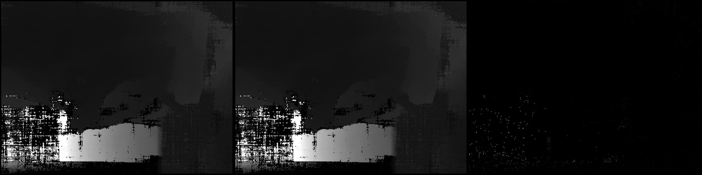
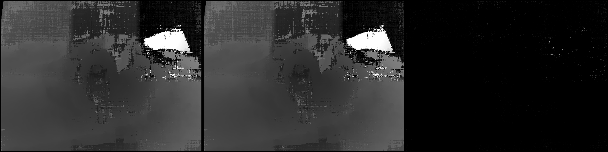

# Validation: monstree-mini6 on house-pc, Radeon RX 5500 XT (Linux, HIP)

First real Linux run of the HIP backend: Linux Mint 22.3 (kernel 7.0), i3-4330, RX 5500 XT
(RDNA1, gfx1012, 8 GB), ROCm 7.2 user-space inside the bundle, emulated mipmaps.
Reference: the CUDA DepthMap produced on the **same machine** by Meshroom 2023.3 with the GTX 1080 Ti.

| | CUDA (GTX 1080 Ti, same host) | HIP (RX 5500 XT) |
|---|---|---|
| DepthMap wall time | 31.9 s | 60.7 s |

* mask agreement >= 95 %: 6 / 6 (all exactly 1.000)
* per-view median relative depth error: 0.0000 on every view
* within 1 %: median over views 0.975, worst 0.962; largest p95 0.0047
* strict criterion: FAIL

Comparing this output against the RX 9070 (Windows) output of the **same AliceVision build**
gives the same spread (97-98.5 % within 1 %, masks identical, median 0): that is the
cross-GPU noise floor of the algorithm itself (texture-filter and FMA rounding differ
between GPU generations), not a port defect. The strict 98 % bar is therefore only
meaningful for same-hardware comparisons; mask identity and zero median error are the
robust checks.

## Panels (left CUDA, middle HIP, right |difference|)

## Per-view table

| view | valid ref | valid test | mask agree | mean rel | median rel | p95 rel | <0.5% | <1% | <5% | simMAD |
|---|---|---|---|---|---|---|---|---|---|---|
| 1136735892 | 0.972 | 0.972 | 1.000 | 0.0120 | 0.0000 | 0.0018 | 0.971 | 0.979 | 0.988 | 0.3090 |
| 1175796198 | 0.972 | 0.972 | 1.000 | 0.0033 | 0.0000 | 0.0015 | 0.973 | 0.979 | 0.988 | 0.1670 |
| 1178536846 | 0.972 | 0.972 | 1.000 | 0.0167 | 0.0000 | 0.0047 | 0.951 | 0.962 | 0.976 | 0.3098 |
| 1302207262 | 0.972 | 0.972 | 1.000 | 0.0195 | 0.0000 | 0.0022 | 0.966 | 0.973 | 0.983 | 0.2941 |
| 1383319223 | 0.968 | 0.968 | 1.000 | 0.0075 | 0.0000 | 0.0028 | 0.961 | 0.969 | 0.981 | 0.2101 |
| 677904057 | 0.972 | 0.972 | 1.000 | 0.0040 | 0.0000 | 0.0016 | 0.971 | 0.978 | 0.988 | 0.1865 |

