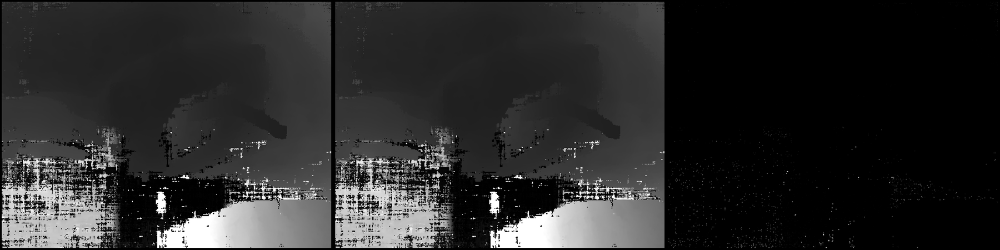
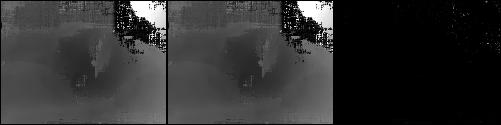

# Validation: monstree-mini6 (6 views) on house-pc, Radeon RX 6750 XT (Linux, HIP)

Same host as the CUDA reference (Meshroom 2023.3, GTX 1080 Ti). RX 6750 XT = RDNA2, gfx1031, 12 GB,
run as gfx1030 (`HSA_OVERRIDE_GFX_VERSION=10.3.0`, the fat binary carried gfx1030 at the time);
i3-4330; ROCm 7.2 user-space in the bundle; emulated mipmaps.

| | CUDA (GTX 1080 Ti, same host) | HIP (RX 6750 XT) |
|---|---|---|
| DepthMap wall time, 6 views | 31.9 s | 31.0 s |

* mask agreement >= 95 %: 6 / 6
* per-view median relative depth error: 0.0000 on every view
* within 1 %: median over views 1.000, worst 1.000; largest p95 0.0000
* strict criterion: PASS (cross-GPU noise floor, see the RX 5500 XT pages)

## Panels (left CUDA, middle HIP, right |difference|)

## Per-view table

| view | valid ref | valid test | mask agree | mean rel | median rel | p95 rel | <0.5% | <1% | <5% | simMAD |
|---|---|---|---|---|---|---|---|---|---|---|
| 1136735892 | 0.972 | 0.972 | 1.000 | 0.0000 | 0.0000 | 0.0000 | 1.000 | 1.000 | 1.000 | 0.0000 |
| 1175796198 | 0.972 | 0.972 | 1.000 | 0.0000 | 0.0000 | 0.0000 | 1.000 | 1.000 | 1.000 | 0.0000 |
| 1178536846 | 0.972 | 0.972 | 1.000 | 0.0000 | 0.0000 | 0.0000 | 1.000 | 1.000 | 1.000 | 0.0000 |
| 1302207262 | 0.972 | 0.972 | 1.000 | 0.0000 | 0.0000 | 0.0000 | 1.000 | 1.000 | 1.000 | 0.0000 |
| 1383319223 | 0.968 | 0.968 | 1.000 | 0.0000 | 0.0000 | 0.0000 | 1.000 | 1.000 | 1.000 | 0.0000 |
| 677904057 | 0.972 | 0.972 | 1.000 | 0.0000 | 0.0000 | 0.0000 | 1.000 | 1.000 | 1.000 | 0.0000 |

