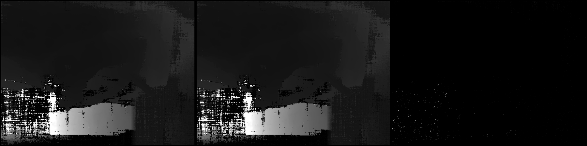
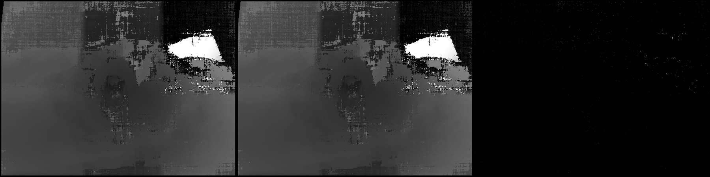
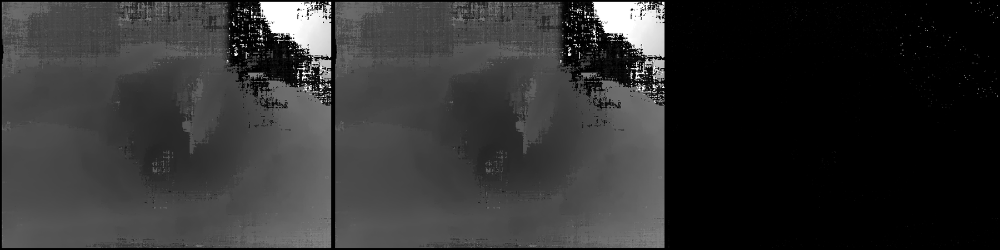

# Validation: monstree-mini6

HIP (Cheshire, RX 9070, Windows) vs CUDA (Meshroom 2023.3, GTX 1080 Ti, Linux) on the same SfM,
same undistorted images and the same DepthMap parameters. Metrics are per view over pixels valid in
both maps: relative depth error |hip - cuda| / cuda.

| | CUDA reference | HIP (Cheshire) |
|---|---|---|
| DepthMap wall time | 31.9 s | 17.4 s |
| views | 6 | 6 |

## Summary

* views with mask agreement >= 95 %: **6 / 6**
* median (over views) of the per-view median relative depth error: **0.0000**
* median (over views) of the fraction of pixels within 1 %: **0.987**
* worst view: 0.984 within 1 %; largest per-view p95: 0.0012
* strict criterion (every view: >=98% of jointly-valid pixels within 1% rel. depth and mask agreement >=95%): **PASS**

## Visual comparison (left: CUDA, middle: HIP, right: |difference|, same depth scale)

### worst: view 1178536846 - 98.4 % within 1 %, mask agreement 1.000

### median: view 1175796198 - 98.8 % within 1 %, mask agreement 1.000

### best: view 677904057 - 99.0 % within 1 %, mask agreement 1.000

## Per-view table

| view | valid ref | valid test | mask agree | mean rel | median rel | p95 rel | <0.5% | <1% | <5% | simMAD |
|---|---|---|---|---|---|---|---|---|---|---|
| 1136735892 | 0.972 | 0.972 | 1.000 | 0.0063 | 0.0000 | 0.0009 | 0.984 | 0.989 | 0.994 | 0.2712 |
| 1175796198 | 0.972 | 0.972 | 1.000 | 0.0019 | 0.0000 | 0.0007 | 0.984 | 0.988 | 0.994 | 0.1228 |
| 1178536846 | 0.972 | 0.972 | 1.000 | 0.0113 | 0.0000 | 0.0012 | 0.978 | 0.984 | 0.990 | 0.2295 |
| 1302207262 | 0.972 | 0.972 | 1.000 | 0.0089 | 0.0000 | 0.0010 | 0.980 | 0.985 | 0.990 | 0.2454 |
| 1383319223 | 0.968 | 0.968 | 1.000 | 0.0039 | 0.0000 | 0.0009 | 0.982 | 0.987 | 0.992 | 0.1387 |
| 677904057 | 0.972 | 0.972 | 1.000 | 0.0018 | 0.0000 | 0.0007 | 0.986 | 0.990 | 0.995 | 0.1326 |
